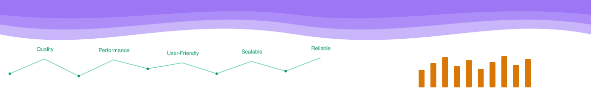

<h2 align="center">Full-Stack Engineer | AI Integrations | Complex Systems &amp; Interactive Data Visualization</h2>

Craft-obsessed full-stack engineer owning feature behavior end to end - UI, API contracts, data, and correctness - across data-heavy web platforms, permission systems, and AI-assisted tooling.

Open to full-time roles and select freelance/contract work.

 

## What I Build

- **Data-heavy web platforms** - dashboards, analysis tools with complex charting, and schema-driven multi-step forms for deeply nested, real-time collaborative data entry, built to hold up under real usage.
- **AI-assisted tooling & pipelines** - production AI pipelines with human review gates, plus an in-app AI assistant that navigates pages, explains charts, and pre-fills forms for review, built on models fine-tuned on the product's own knowledge base.
- **Full-stack feature ownership** - from UI to API contracts to database persistence, keeping behavior consistent across web, mobile, and backend.
- **Access control & permission systems** - role-based access, impersonation, and approval layers where security boundaries actually matter.
- **Mentorship & code review** - onboarded new engineers to the codebase, advised on architecture and implementation approach for tricky features, and gave code review feedback focused on raising code quality and engineer growth, not just gatekeeping.

 

## Tech Stack

|  |  |
|---|---|
| **Frontend** |      |
| **Backend** |     |
| **AI** |     -3776AB?style=flat-square&logo=python&logoColor=white) |
| **Tools** |    |

 

<b>Also familiar with (full stack, 40+ tools &amp; practices) - click to expand</b>

 

|  |  |
|---|---|
| **Frontend & UI** |         -4B5563?style=flat-square)    |
| **Data Visualization & Graphics** |      |
| **Mobile** | -20232A?style=flat-square&logo=react&logoColor=61DAFB) |
| **Backend** |         |
| **Data & Infrastructure** |         |
| **Testing & QA** |    |
| **Engineering Practices** |      |

*...and more - happy to walk through specifics for a given role or project.*

 

## Featured Projects

*Case studies in progress - coming soon.*

<!--
PROJECT CARD TEMPLATE - duplicate this block per project once ready:

### Project Name
One-line description of what it does and the problem it solves.

**Stack:** React, Node.js, PostgreSQL

[Live demo](#) - [Case study](#)

-->

 

## Get in Touch

<!-- Add once available:

-->

